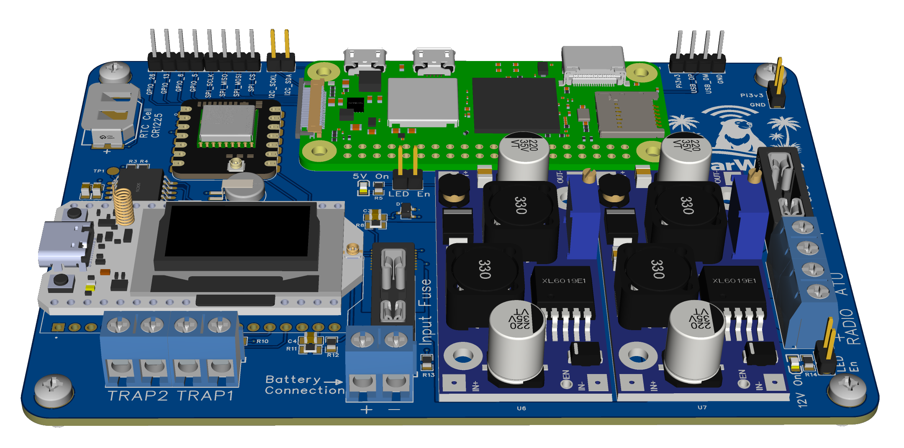
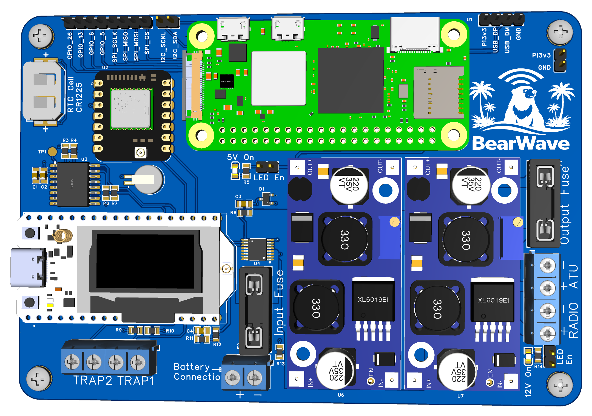

# BearWave Hardware - Final Board Design

## 📋 Overview

This repository contains the complete hardware documentation for the **BearWave** NVIS (Near Vertical Incidence Skywave) communication system designed for remote wildlife monitoring in the Borneo rainforest. The board integrates a Raspberry Pi Zero 2 W, Heltec V3.2 ESP32 module, GPS, RTC, power management, and radio interfaces for reliable long-range communication in challenging environments.

**GitHub Repository:** [https://github.com/butterworthma/Hardware](https://github.com/butterworthma/Hardware)

## 🎯 Project Purpose

The BearWave hardware platform enables remote wildlife monitoring at the Danau Girang Field Centre (DGFC), Malaysia, providing reliable NVIS communication capabilities for conservation applications in tropical rainforest environments.

## 🖼️ Final Board Design

### Top View - Complete Assembly

The main board features:
- **Blue PCB** with rounded corners (professional manufacturing)
- **Green Raspberry Pi Zero 2 W** daughterboard mounted on standoffs
- **BearWave branding** with logo (bear on island with palm trees and radio waves)
- **Comprehensive I/O** for sensors, radio, and power management

### 3D Rendering View

## 🔌 Key Components

### 1. Raspberry Pi Zero 2 W Module (Top Center)
- **Location**: Green daughterboard mounted horizontally on main blue PCB
- **Features**:
  - Dual micro-USB ports (power and data)
  - Mini-HDMI port for display output
  - Micro-SD card slot for operating system storage
  - 40-pin GPIO header connecting to main board
  - Mounted on standoffs for proper clearance

### 2. Heltec V3.2 ESP32 Module
- **Function**: WiFi/Bluetooth connectivity and additional processing
- **Integration**: Connected via UART and I2C to Raspberry Pi
- **Features**: Built-in display driver, GPS interface, power management control

### 3. Real-Time Clock (RTC) Module (Top Left)
- **Component**: DS3231M+ RTC chip with CR1225 coin cell backup
- **Location**: Top-left section of board
- **Features**:
  - Battery-backed timekeeping (CR1225 cell)
  - I2C communication interface
  - Interrupt output for wake-up functionality
  - High accuracy (±2ppm from -40°C to +85°C)

### 4. GPS Module (Middle Section)
- **Function**: Precise location and time synchronization
- **Features**:
  - Battery backup for hot-start capability
  - UART communication (GPS_TX, GPS_RX)
  - Wake-up functionality for power management

### 5. Power Management System (Middle Section)
- **Input Protection**:
  - Fused main battery input (5A fuse)
  - Reverse polarity protection (LTC4358CFE ideal diode controller)
  - Max continuous current: 5A
  
- **Voltage Regulation**:
  - **5V Boost Converter** (XL6019E1): Powers Raspberry Pi and peripherals
  - **12V Boost Converter** (XL6019E1): Powers radio and ATU systems
  - **3.3V Regulation**: For low-power components
  
- **Indicators**:
  - LED indicators for 5V and 12V power status
  - Enable/disable jumpers for power control

### 6. I/O Connectors

#### GPIO Headers (Top Left)
- **GPIO Pins**: GPIO_26, GPIO_13, GPIO_6, GPIO_5
- **SPI Interface**: SCLK, MISO, MOSI, CS
- **I2C Interface**: SCLK, SDA
- **Power**: Pi3V3, GND

#### Screw Terminals
- **Battery Connection**: Main power input (+/-)
- **RADIO**: Radio module power and control (+/-)
- **ATU**: Antenna Tuning Unit connections (+/-)
- **TRAP1/TRAP2**: External sensor/trap connections
- **Input/Output**: Power distribution terminals (IN+/IN-, OUT+/OUT-)

### 7. Display Module (Bottom Left)
- **Type**: OLED or LCD display module
- **Connection**: USB-C interface
- **Function**: System status and data visualization

## 📐 Board Specifications

- **PCB Color**: Blue (standard FR4)
- **Shape**: Rectangular with rounded corners
- **Mounting**: Standoffs for Raspberry Pi Zero 2 W
- **Silkscreen**: White text and component labels
- **Finish**: Professional HASL or ENIG finish

## 🔧 Technical Features

### Communication Interfaces
- **SPI**: High-speed serial communication
- **I2C**: Multi-device bus communication
- **UART**: Serial communication for GPS and debugging
- **USB**: Data transfer and power

### Power Management
- **Input Range**: Compatible with various battery voltages
- **Output Voltages**: 3.3V, 5V, 12V
- **Efficiency**: Boost converters for optimal power usage
- **Protection**: Fuses and reverse polarity protection

### Environmental Considerations
- **Operating Temperature**: Designed for tropical environments
- **Humidity Protection**: Conformal coating compatible
- **Durability**: Professional PCB manufacturing standards

## 📦 Bill of Materials (BOM)

See [BOM Documentation](docs/BOM_Board1_Schematic1_2026-01-05.md) for complete component list.

**Key Components:**
- Raspberry Pi Zero 2 W
- Heltec V3.2 ESP32 Module
- DS3231M+ RTC with CR1225 battery
- XL6019E1 Boost Converters (x2)
- LTC4358CFE Reverse Polarity Protection
- GPS Module with battery backup
- Various passive components (resistors, capacitors, inductors)

## 📄 Documentation

- **[Detailed Board Annotations](docs/board_annotations.md)** - Complete component-by-component breakdown
- **[Schematic Documentation](docs/schematic.md)** - Circuit design details
- **[BOM List](docs/BOM_Board1_Schematic1_2026-01-05.md)** - Complete bill of materials
- **[Assembly Guide](docs/assembly.md)** - Step-by-step assembly instructions

## 🔗 Related Projects

- **Software Repository**: [BearWave-Paper2](https://github.com/butterworthma/BearWave-Paper2)
- **Research Context**: NVIS communication for wildlife monitoring

## 📞 Support

For hardware questions or issues:
- Open an issue on [GitHub](https://github.com/butterworthma/Hardware/issues)
- Refer to documentation in the `docs/` directory

## 📄 License

[Specify your license here]

## 🙏 Acknowledgments

Designed for remote wildlife monitoring research at Danau Girang Field Centre (DGFC), Malaysia, as part of PhD research at Cardiff University.
